# nmem Plots Documentation

This directory contains plots generated by the nmem project plotting scripts.

**Plot Style:** paper
**Generated:** 2025-06-27 11:31:59

## Plots Overview

### plot_array_fidelity_bar

**Script:** `plot_array_fidelity_bar.py`

**Description:** Generate array fidelity bar plots showing bit error rates across memory array positions.

Creates both 3D and clean 2D bar visualizations of BER data to analyze
memory array performance and identify spatial patterns in error rates.

**Images:**
- Figure 1: 
- Figure 2: 

---

### plot_array_parameter_matrix

**Script:** `plot_array_parameter_matrix.py`

**Description:** Generate array parameter matrix visualization for various memory cell parameters.

Creates spatial heatmaps displaying different parameter distributions across memory cells
in the array, including write current, read current, enable currents, and other
characteristics. Enables identification of process variations and optimization
of array-level performance characteristics.

Usage:
    python plot_array_parameter_matrix.py --parameter write_current
    python plot_array_parameter_matrix.py --parameter read_current --save-dir ./output
    python plot_array_parameter_matrix.py --parameter enable_write_current

**Array Parameter Matrix Plots:**

| Parameter | Plot | Parameter | Plot |
|-----------|------|-----------|------|
| Bit Error Rate |  | Enable Read Current |  |
| Enable Read Power |  | Enable Write Current |  |
| Enable Write Power | 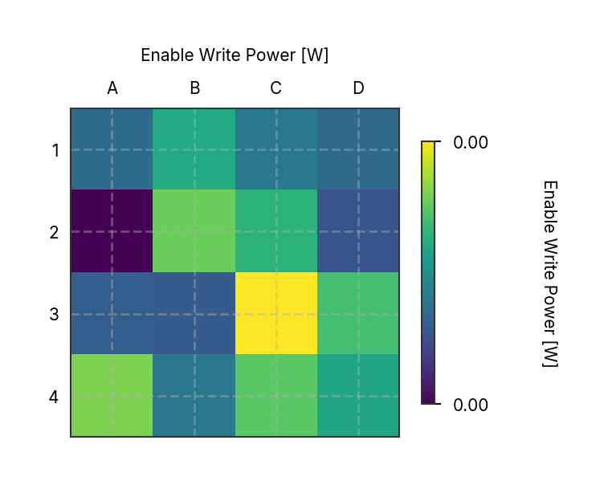 | Max Critical Current | 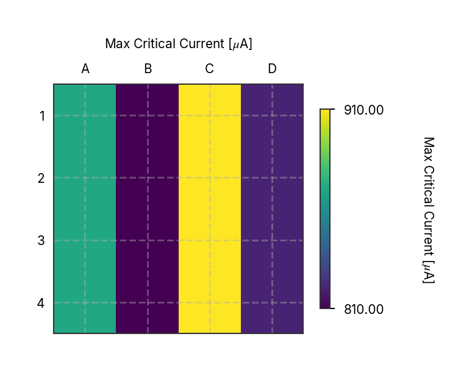 |
| Read Current | 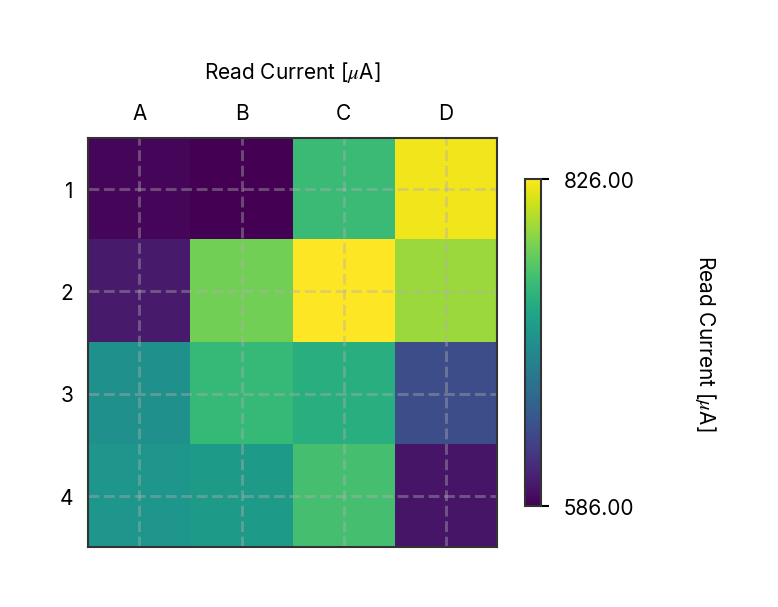 | Resistance |  |
| Slope |  | Write Current |  |
| X Intercept |  | Y Intercept |  |

---

### plot_autoprobe_resistance_matrix

**Script:** `plot_autoprobe_resistance_matrix.py`

**Description:** Plot Autoprobe Resistance Matrix. 

This script loads resistance data from an autoprobe measurement,
summarizes the yield across specified wafer rows, and generates
combined histogram and die maps to visualize the resistance distribution.

Measurements were performed in the Palacios lab at room temperature. 
Rows 1, 4, 6, and 7 were selected for analysis.

**Image:** 

---

### plot_ber_branch_currents_sweep

**Script:** `plot_ber_branch_currents_sweep.py`

**Description:** Plot Branch Currents Sweep for BER Analysis

Calculates and visualizes the critical current as a function of temperature
of each branch in a memory cell. Measured data is used for reference.

**Image:** 

---

### plot_ber_enable_write_sweep

**Script:** `plot_ber_enable_write_sweep.py`

**Description:** Bit Error Rate vs Enable/Write Current Sweep Analysis

This script analyzes and visualizes the relationship between bit error rate (BER)
and enable/write current combinations. It generates plots showing how BER varies
with different current settings, helping to identify optimal operating parameters
for memory write operations. Includes both sweep plots and state current markers
to provide comprehensive analysis of write current dependencies.

**Images:**
- Figure 1: 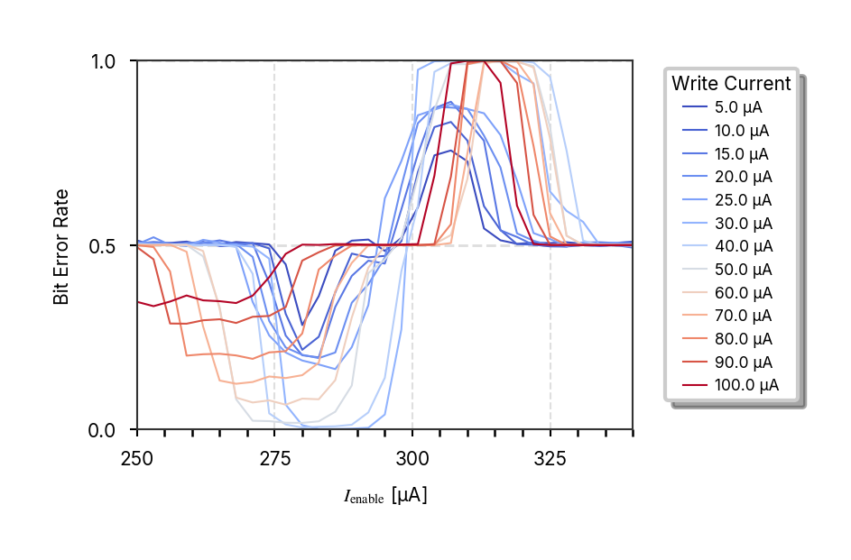
- Figure 2: 
- Figure 3: 
- Figure 4: 

---

### plot_ber_enable_write_sweep_fine

**Script:** `plot_ber_enable_write_sweep_fine.py`

**Description:** Plot the bit error rate as a function of the enable write current. 

Sweeps are shown for different write currents, allowing analysis of 
how the enable write current affects the bit error rate across various 
write current set points.

**Image:** 

---

### plot_ber_enable_write_sweep_persistent_current

**Script:** `plot_ber_enable_write_sweep_persistent_current.py`

**Description:** Plot the calculated and experimentally extracted state currents for a fixed persistent current. 

This script visualizes the nominal (blue) and inverting (red) operating regions as a function of the temperature. 
Incomplete results.

**Image:** 

---

### plot_ber_memory_retention

**Script:** `plot_ber_memory_retention.py`

**Description:** Plot Bit Error Rate (BER) Memory Retention

Generates a plot showing the relationship between memory retention time and bit error rate
Times shorter than 10ms were programmed by adjusting the waveform output. Longer delays were programmed with software defined triggers.

**Image:** 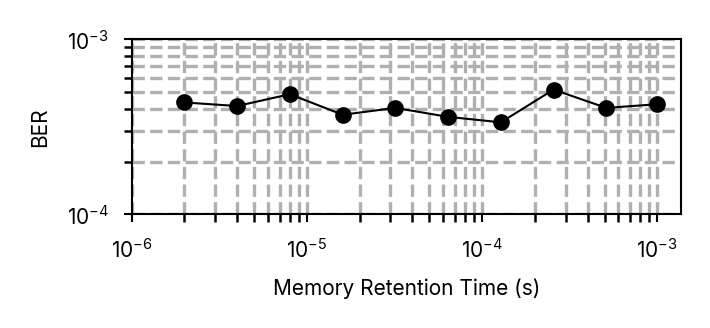

---

### plot_ber_prbs_probe_station_trace

**Script:** `plot_ber_prbs_probe_station_trace.py`

**Description:** Captured voltage traces from PRBS measurements performed in the probe station at 3.5K. 
Each trace contains eight consecutive write/read operations with a 1µs delay between operations. 
Traces are offset vertically for clarity. Set bit streams are plotted to the right. Errors are highlighted in red. 

Total errors: 18/50e3, W1R0: 8, W0R1: 10

**Image:** 

---

### plot_ber_read_current_operating

**Script:** `plot_ber_read_current_operating.py`

**Description:** Bit error rate (BER) as a function of the read current for various write current setpoints. 
The switching probability is also plotted for each read current.

The width of each operating region (defined where the trace exceeds and returns from a ±5% bound from 0.5 is plotted as a function of the write current. 
The width is approximately equal to the stored persistent current. 

Incomplete analysis. Attempting to derive a relationship between the write current and the stored persistent current.

**Image:** 

---

### plot_ber_read_current_sweep_enable_read

**Script:** `plot_ber_read_current_sweep_enable_read.py`

**Description:** No description available

**Image:** 

---

### plot_ber_read_current_sweep_enable_write

**Script:** `plot_ber_read_current_sweep_enable_write.py`

**Description:** No description available

**Image:** 

---

### plot_ber_read_current_sweep_ew_width

**Script:** `plot_ber_read_current_sweep_ew_width.py`

**Description:** No description available

**Image:** 

---

### plot_ber_read_current_sweep_read_width

**Script:** `plot_ber_read_current_sweep_read_width.py`

**Description:** Plot Bit Error Rate (BER) as a function of read current for various read widths.

The width of the pulse is defined by the number of points in the waveform.
Approximately, the pulse widths range from 5ns to 150ns.

**Image:** 

---

### plot_ber_read_current_sweep_sim

**Script:** `plot_ber_read_current_sweep_sim.py`

**Description:** No description available

**Image:** 

---

### plot_ber_read_current_sweep_three

**Script:** `plot_ber_read_current_sweep_three.py`

**Description:** No description available

**Image:** 

---

### plot_ber_read_current_sweep_write_current

**Script:** `plot_ber_read_current_sweep_write_current.py`

**Description:** Main function to generate BER read current sweep write current plots.

**Image:** 

---

### plot_ber_read_current_sweep_write_current2

**Script:** `plot_ber_read_current_sweep_write_current2.py`

**Description:** Main function to plot read current sweep data.

**Image:** 

---

### plot_ber_read_current_sweep_write_current3

**Script:** `plot_ber_read_current_sweep_write_current3.py`

**Description:** No description available

**Images:**
- Figure 1: 
- Figure 2: 

---

### plot_ber_read_current_sweep_write_current_coarse

**Script:** `plot_ber_read_current_sweep_write_current_coarse.py`

**Description:** No description available

**Image:** 

---

### plot_ber_read_current_sweep_write_current_fine

**Script:** `plot_ber_read_current_sweep_write_current_fine.py`

**Description:** No description available

**Image:** 

---

### plot_ber_read_current_sweep_write_width

**Script:** `plot_ber_read_current_sweep_write_width.py`

**Description:** No description available

**Image:** 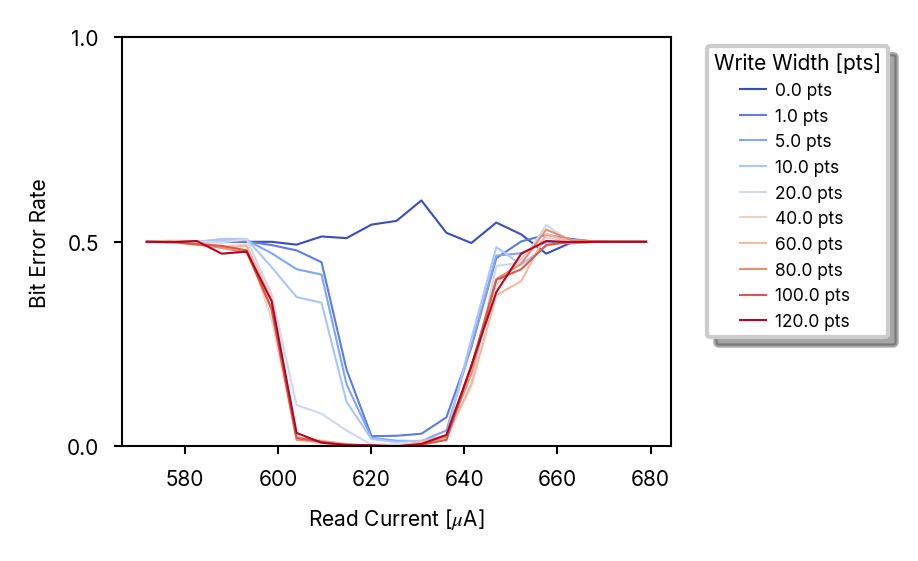

---

### plot_ber_read_sweep_fitting

**Script:** `plot_ber_read_sweep_fitting.py`

**Description:** No description available

**Image:** 

---

### plot_ber_read_sweep_memory_retention

**Script:** `plot_ber_read_sweep_memory_retention.py`

**Description:** No description available

**Image:** 

---

### plot_ber_write_current_sweep_enable_margin

**Script:** `plot_ber_write_current_sweep_enable_margin.py`

**Description:** No description available

**Image:** 

---

### plot_ber_write_current_sweep_operation

**Script:** `plot_ber_write_current_sweep_operation.py`

**Description:** No description available

**Image:** 

---

### plot_c2_c3_comparison

**Script:** `plot_c2_c3_comparison.py`

**Description:** No description available

**Image:** 

---

### plot_c3_subplots

**Script:** `plot_c3_subplots.py`

**Description:** No description available

**Image:** 

---

### plot_compare_energy_bar

**Script:** `plot_compare_energy_bar.py`

**Description:** Energy Comparison Bar Chart

This script generates a 3D extruded bar chart comparing energy consumption
across different memory technologies. The plot visualizes energy per bit
operation for various superconducting and semiconducting memory types,
providing a clear comparison of their energy efficiency characteristics.

**Image:** 

---

### plot_compare_metrics_spider

**Script:** `plot_compare_metrics_spider.py`

**Description:** Plot a radar chart comparing various memory metrics across different datasets.
This script generates a spider plot (radar chart) to visualize and compare multiple memory metrics.

**Image:** 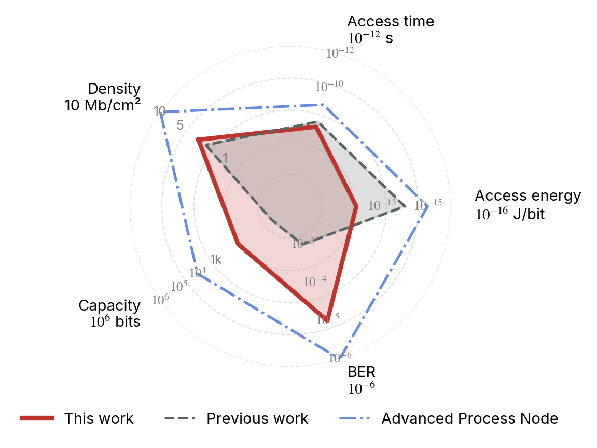

---

### plot_compare_size_bar

**Script:** `plot_compare_size_bar.py`

**Description:** Generate memory scaling comparison plots showing capacity and density.

**Image:** 

---

### plot_elionix_log_alignment

**Script:** `plot_elionix_log_alignment.py`

**Description:** Plot Elionix alignment log data.
This script imports alignment data from an Elionix log file, analyzes the alignment statistics,
and generates plots for alignment statistics and offset histograms.

**Images:**
- Figure 1: 
- Figure 2: 

---

### plot_enable_current_vs_temp

**Script:** `plot_enable_current_vs_temp.py`

**Description:** No description available

**Image:** 

---

### plot_geom_loop_size

**Script:** `plot_geom_loop_size.py`

**Description:** No description available

**Image:** 

---

### plot_ic_enable_current_relation_v2

**Script:** `plot_ic_enable_current_relation_v2.py`

**Description:** Main function to plot enable current relation grids and columns/rows.

Args:
    save_dir: If provided, saves figures to this directory instead of showing them

**Images:**
- Figure 1: 
- Figure 2: 
- Figure 3: 
- Figure 4: 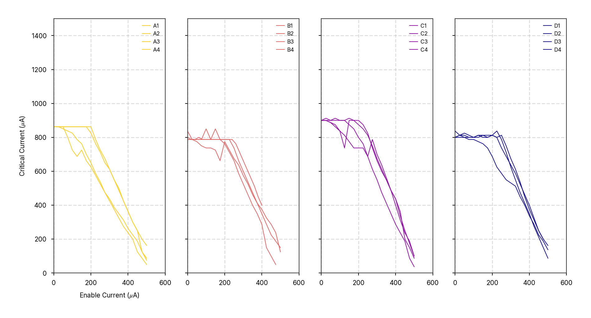

---

### plot_ic_temperature_sweep_array

**Script:** `plot_ic_temperature_sweep_array.py`

**Description:** No description available

**Image:** 

---

### plot_ic_vs_ih_array

**Script:** `plot_ic_vs_ih_array.py`

**Description:** No description available

**Image:** 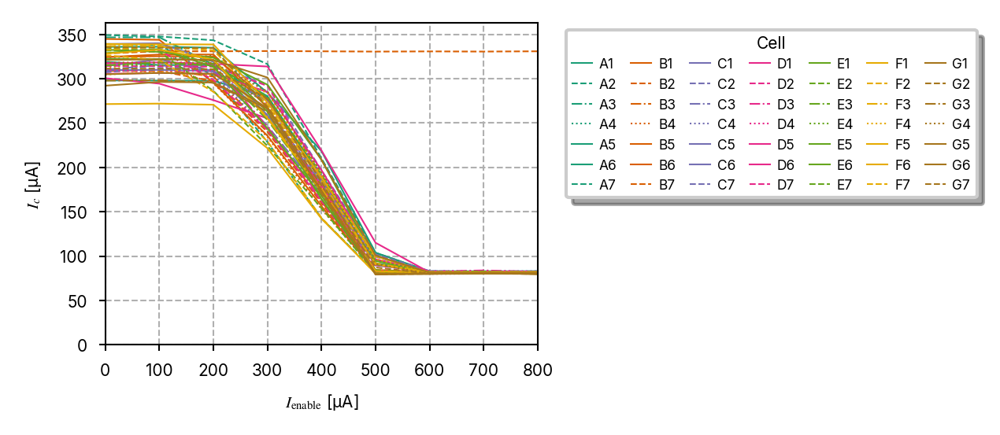

---

### plot_iv_temperature_sweep

**Script:** `plot_iv_temperature_sweep.py`

**Description:** Main function to generate IV temperature sweep plots.

**Images:**
- Figure 1: 
- Figure 2: 
- Figure 3: 

---

### plot_ntron_dose_images

**Script:** `plot_ntron_dose_images.py`

**Description:** No description available

**Image:** 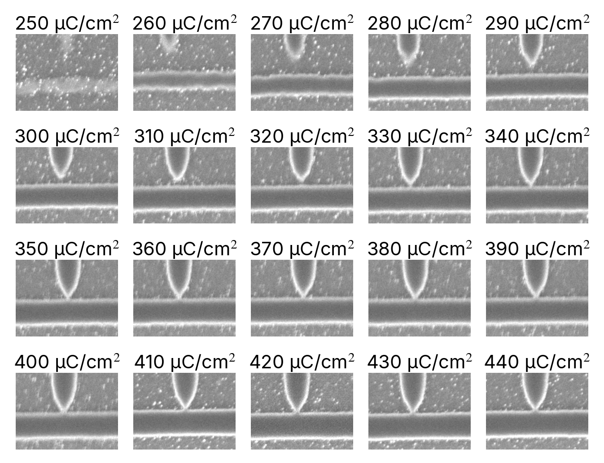

---

### plot_voltage_read_histogram

**Script:** `plot_voltage_read_histogram.py`

**Description:** No description available

**Image:** 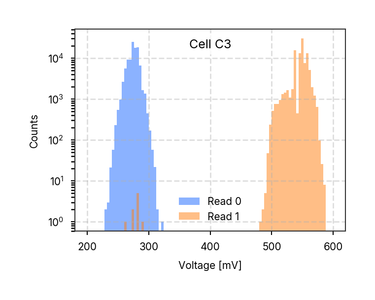

---

### plot_voltage_trace_array_emulation

**Script:** `plot_voltage_trace_array_emulation.py`

**Description:** No description available

**Image:** 

---

### plot_voltage_trace_averaged

**Script:** `plot_voltage_trace_averaged.py`

**Description:** Script to plot averaged voltage traces from a directory of data files.

**Image:** 

---

### plot_voltage_trace_stack_off

**Script:** `plot_voltage_trace_stack_off.py`

**Description:** No description available

**Image:** 

---

### plot_voltage_trace_stack_on

**Script:** `plot_voltage_trace_stack_on.py`

**Description:** No description available

**Image:** 

---

### plot_voltage_write_current_sweep_off

**Script:** `plot_voltage_write_current_sweep_off.py`

**Description:** No description available

**Image:** 

---

### plot_voltage_write_current_sweep_on

**Script:** `plot_voltage_write_current_sweep_on.py`

**Description:** No description available

**Image:** 

---

### plot_wafer_thickness_map

**Script:** `plot_wafer_thickness_map.py`

**Description:** Plot wafer thickness maps before and after SiO2 PECVD.
This script loads thickness data from CSV files, interpolates the data onto a grid,
and generates visualizations of the wafer maps before and after deposition, as well as the
deposited thickness.

**Image:** 

---

## Script Execution

All plots were generated using:

```bash
python run_all_plotting_scripts.py --style paper
```

Individual plots can be regenerated by running their respective scripts in the `src/nmem/scripts/` directory.
