# nmem Plots Documentation

This directory contains plots generated by the nmem project plotting scripts.

**Plot Style:** paper
**Generated:** 2025-07-30 16:26:39

## Plots Overview

### plot_array_parameter_matrix

**Script:** `plot_array_parameter_matrix.py`

**Description:** Generate array parameter matrix visualization for various memory cell parameters.

Creates spatial heatmaps displaying different parameter distributions across memory cells
in the array, including write current, read current, enable currents, and other
characteristics. Enables identification of process variations and optimization
of array-level performance characteristics.

Usage:
    python plot_array_parameter_matrix.py --parameter write_current
    python plot_array_parameter_matrix.py --parameter read_current --save-dir ./output
    python plot_array_parameter_matrix.py --parameter enable_write_current

**Array Parameter Matrix Plots:**

| Parameter | Plot | Parameter | Plot |
|-----------|------|-----------|------|
| Bit Error Rate | 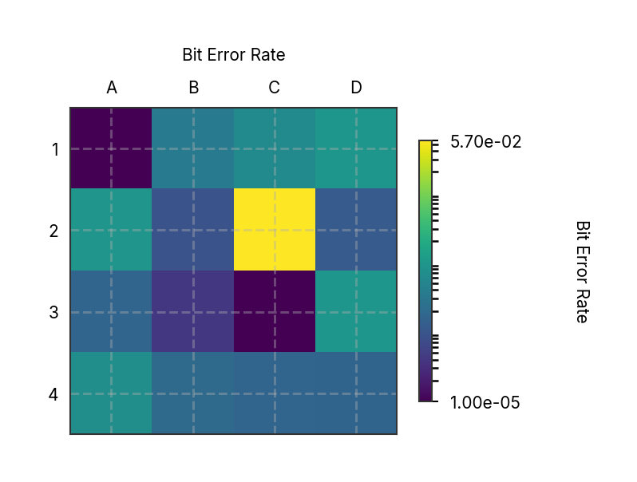 | Enable Read Current |  |
| Enable Read Power |  | Enable Write Current | 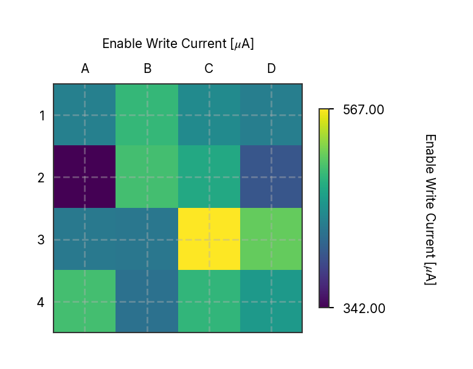 |
| Enable Write Power |  | Max Critical Current |  |
| Read Current |  | Resistance |  |
| Slope |  | Write Current | 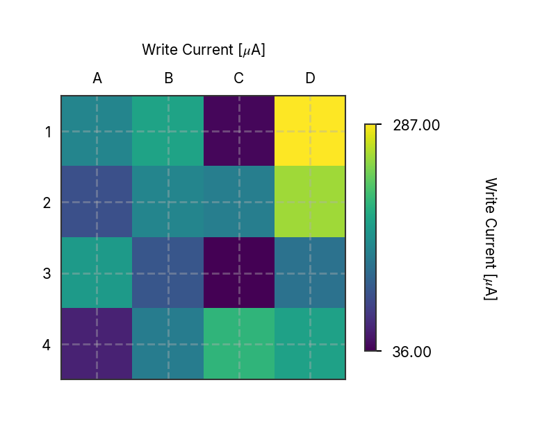 |
| X Intercept | 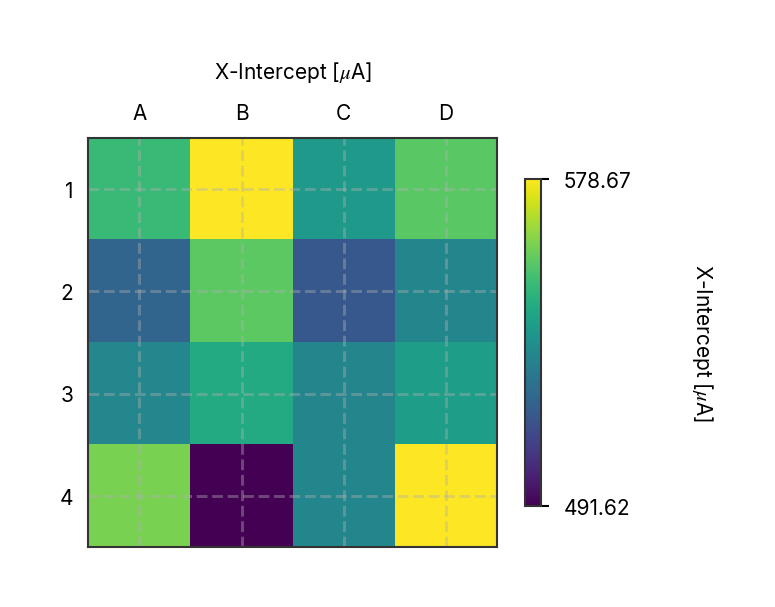 | Y Intercept | 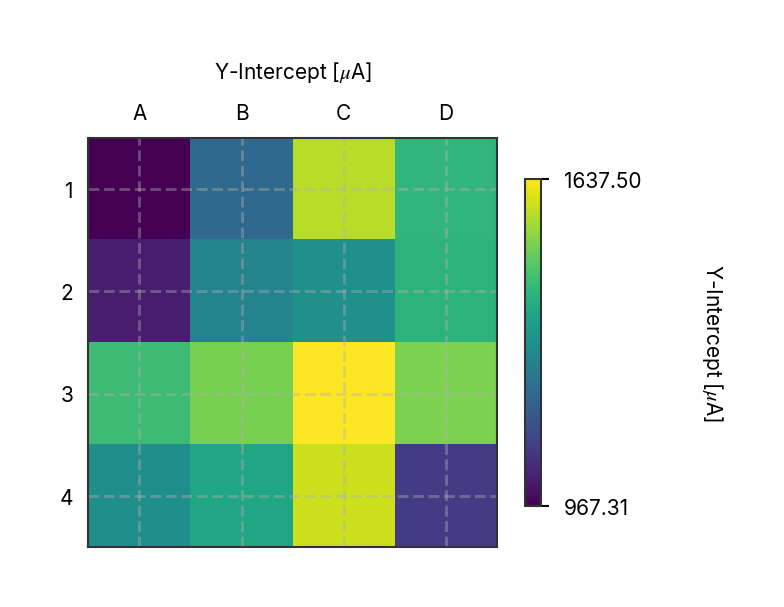 |

---

### plot_ber_3d_bar_plot

**Script:** `plot_ber_3d_bar_plot.py`

**Description:** No description available

**Image:** 

---

### plot_ber_enable_write_sweep

**Script:** `plot_ber_enable_write_sweep.py`

**Description:** Bit Error Rate vs Enable/Write Current Sweep Analysis

This script analyzes and visualizes the relationship between bit error rate (BER)
and enable/write current combinations. It generates plots showing how BER varies
with different current settings, helping to identify optimal operating parameters
for memory write operations.

**Images:**
- Figure 1: 
- Figure 2: 

---

### plot_ber_enable_write_sweep_fine

**Script:** `plot_ber_enable_write_sweep_fine.py`

**Description:** Plot the bit error rate as a function of the enable write current. 

Sweeps are shown for different write currents, allowing analysis of 
how the enable write current affects the bit error rate across various 
write current set points.

**Image:** 

---

### plot_ber_geom_loop_size

**Script:** `plot_ber_geom_loop_size.py`

**Description:** Plot Bit Error Rate (BER) analysis for geometric loop size sweep.

This script generates two plots:
1. BER vs channel voltage for different loop sizes
2. Minimum BER vs loop size

The geometric loop size parameter (w_5) affects the memory cell's switching
characteristics and BER performance. These measurements were performed in the probe station
at a base temperature of 3.5K.
The estimated BER was calculated by fitting two gaussian functions to the data and taking the intersection of the fitted curves.

The data here is insufficient to determine the optimal loop size, but it provides a good starting point for further analysis.

**Image:** 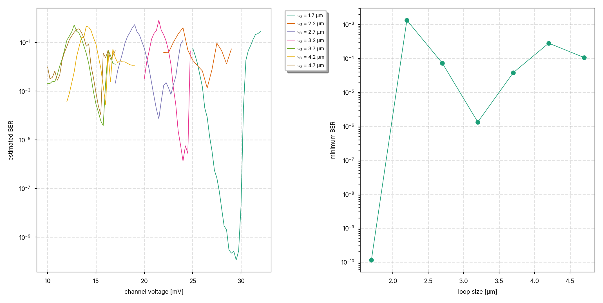

---

### plot_ber_memory_retention

**Script:** `plot_ber_memory_retention.py`

**Description:** Plot Bit Error Rate (BER) Memory Retention

Generates a plot showing the relationship between memory retention time and bit error rate
Times shorter than 10ms were programmed by adjusting the waveform output. Longer delays were programmed with software defined triggers.

**Image:** 

---

### plot_ber_prbs_probe_station_trace

**Script:** `plot_ber_prbs_probe_station_trace.py`

**Description:** Captured voltage traces from PRBS measurements performed in the probe station at 3.5K. 
Each trace contains eight consecutive write/read operations with a 1µs delay between operations. 
Traces are offset vertically for clarity. Set bit streams are plotted to the right. Errors are highlighted in red. 

Total errors: 18/50e3, W1R0: 8, W0R1: 10

**Image:** 

---

### plot_ber_read_current_sweep_enable_read

**Script:** `plot_ber_read_current_sweep_enable_read.py`

**Description:** No description available

**Image:** 

---

### plot_ber_read_current_sweep_enable_write

**Script:** `plot_ber_read_current_sweep_enable_write.py`

**Description:** No description available

**Image:** 

---

### plot_ber_read_current_sweep_enable_write_trio

**Script:** `plot_ber_read_current_sweep_enable_write_trio.py`

**Description:** # Script to plot the bit error rate (BER) for read current sweeps at 
# multiple enable read currents and three enable write currents.

**Image:** 

---

### plot_ber_read_current_sweep_ew_width

**Script:** `plot_ber_read_current_sweep_ew_width.py`

**Description:** No description available

**Image:** 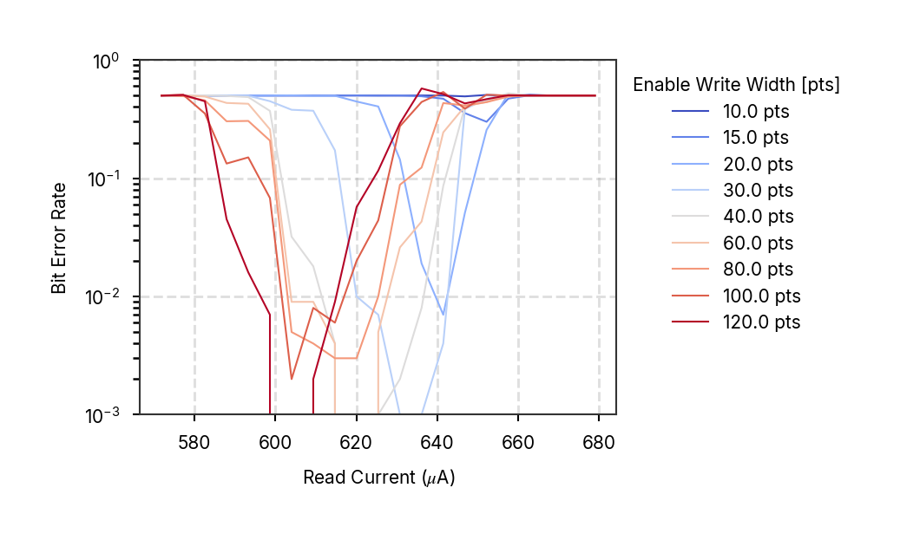

---

### plot_ber_read_current_sweep_read_width

**Script:** `plot_ber_read_current_sweep_read_width.py`

**Description:** No description available

**Image:** 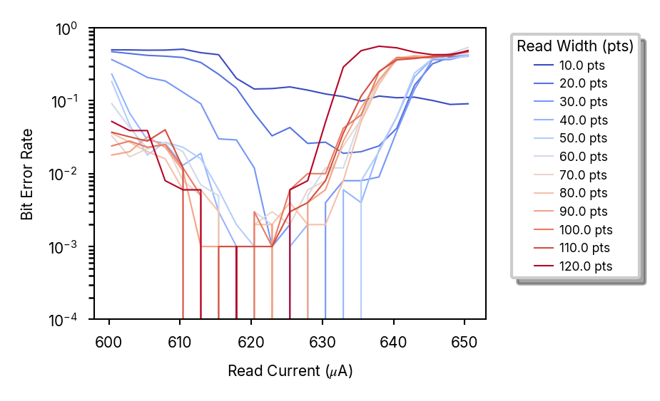

---

### plot_ber_read_current_sweep_sim

**Script:** `plot_ber_read_current_sweep_sim.py`

**Description:** No description available

**Image:** 

---

### plot_ber_read_current_sweep_write_current

**Script:** `plot_ber_read_current_sweep_write_current.py`

**Description:** Main function to generate BER read current sweep write current plots.

**Image:** 

---

### plot_ber_read_current_sweep_write_current2

**Script:** `plot_ber_read_current_sweep_write_current2.py`

**Description:** Main function to plot read current sweep data.

**Image:** 

---

### plot_ber_read_current_sweep_write_current3

**Script:** `plot_ber_read_current_sweep_write_current3.py`

**Description:** No description available

**Images:**
- Figure 1: 
- Figure 2: 

---

### plot_ber_read_current_sweep_write_current_coarse

**Script:** `plot_ber_read_current_sweep_write_current_coarse.py`

**Description:** No description available

**Image:** 

---

### plot_ber_read_current_sweep_write_current_fine

**Script:** `plot_ber_read_current_sweep_write_current_fine.py`

**Description:** No description available

**Image:** 

---

### plot_ber_read_current_sweep_write_width

**Script:** `plot_ber_read_current_sweep_write_width.py`

**Description:** No description available

**Image:** 

---

### plot_ber_read_sweep_fitting

**Script:** `plot_ber_read_sweep_fitting.py`

**Description:** No description available

**Image:** 

---

### plot_ber_read_sweep_memory_retention

**Script:** `plot_ber_read_sweep_memory_retention.py`

**Description:** No description available

**Image:** 

---

### plot_ber_vs_read_current_array

**Script:** `plot_ber_vs_read_current_array.py`

**Description:** Plot BER vs read current for different write currents.

This script analyzes bit error rate as a function of read current for various
write current setpoints. Shows the operating regions and switching behavior
of the memory cell under different read conditions.

**Image:** 

---

### plot_ber_write_current_enable_margin_markers

**Script:** `plot_ber_write_current_enable_margin_markers.py`

**Description:** Write Current Enable Margin Markers Analysis

This script generates plots showing temperature markers vs write current,
displaying the operating margins and bounds for write current settings.
These markers help identify safe operating regions and enable current margins
for reliable memory write operations.

**Image:** 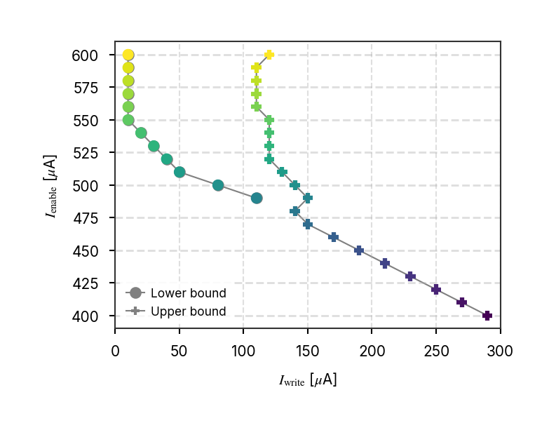

---

### plot_ber_write_current_sweep_enable_write

**Script:** `plot_ber_write_current_sweep_enable_write.py`

**Description:** BER vs Write Current Sweep Analysis

This script generates plots showing the relationship between bit error rate (BER)
and write current values. It visualizes how BER varies across different write
current settings, helping to identify optimal write current ranges for reliable
memory operations.

**Image:** 

---

### plot_c2_c3_comparison

**Script:** `plot_c2_c3_comparison.py`

**Description:** No description available

**Image:** 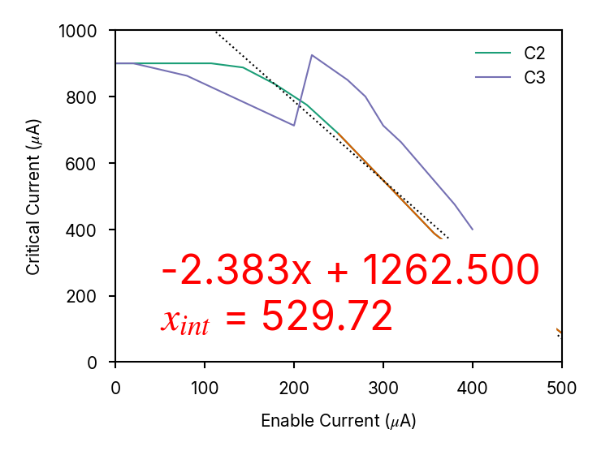

---

### plot_c3_subplots

**Script:** `plot_c3_subplots.py`

**Description:** No description available

**Image:** 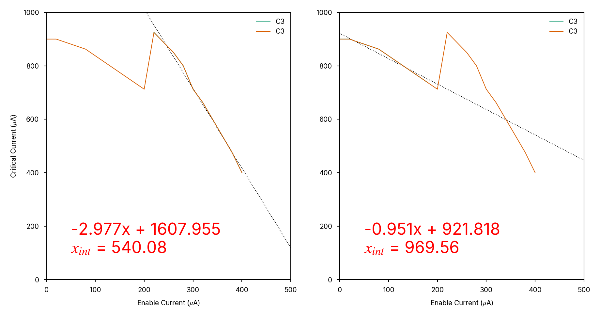

---

### plot_calc_branch_currents

**Script:** `plot_calc_branch_currents.py`

**Description:** Plot Branch Currents Sweep for BER Analysis

Calculates and visualizes the critical current as a function of temperature
of each branch in a memory cell. Measured data is used for reference.

**Image:** 

---

### plot_compare_energy_bar

**Script:** `plot_compare_energy_bar.py`

**Description:** Energy Comparison Bar Chart

This script generates a 3D extruded bar chart comparing energy consumption
across different memory technologies. The plot visualizes energy per bit
operation for various superconducting and semiconducting memory types,
providing a clear comparison of their energy efficiency characteristics.

**Image:** 

---

### plot_compare_metrics_spider

**Script:** `plot_compare_metrics_spider.py`

**Description:** Plot a radar chart comparing various memory metrics across different datasets.
This script generates a spider plot (radar chart) to visualize and compare multiple memory metrics.

**Image:** 

---

### plot_compare_size_bar

**Script:** `plot_compare_size_bar.py`

**Description:** Generate memory scaling comparison plots showing capacity and density.

**Image:** 

---

### plot_elionix_log_alignment_histogram

**Script:** `plot_elionix_log_alignment_histogram.py`

**Description:** No description available

**Image:** 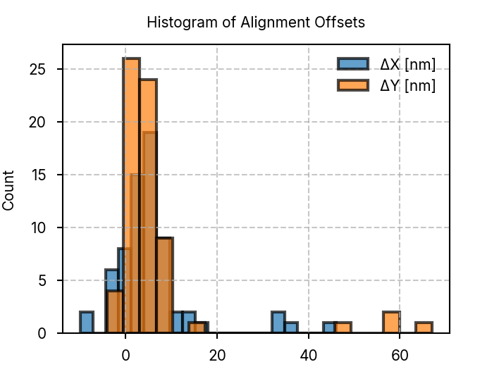

---

### plot_elionix_log_alignment_stats

**Script:** `plot_elionix_log_alignment_stats.py`

**Description:** No description available

**Image:** 

---

### plot_enable_current_vs_temp

**Script:** `plot_enable_current_vs_temp.py`

**Description:** No description available

**Image:** 

---

### plot_fab_autoprobe_resistance_matrix

**Script:** `plot_fab_autoprobe_resistance_matrix.py`

**Description:** Plot Autoprobe Resistance Matrix. 

This script loads resistance data from an autoprobe measurement,
summarizes the yield across specified wafer rows, and generates
combined histogram and die maps to visualize the resistance distribution.

Measurements were performed in the Palacios lab at room temperature. 
Rows 1, 4, 6, and 7 were selected for analysis.

**Image:** 

---

### plot_fab_ntron_dose_images

**Script:** `plot_fab_ntron_dose_images.py`

**Description:** # Script to plot images of NTRON dose test results
# Images are of different nTron test structures written at various doses. 
# Each image is a new device written with the same current and write settings.  
#

**Image:** 

---

### plot_fab_wafer_thickness_map

**Script:** `plot_fab_wafer_thickness_map.py`

**Description:** Plot wafer thickness maps before and after SiO2 PECVD.
This script loads thickness data from CSV files, interpolates the data onto a grid,
and generates visualizations of the wafer maps before and after deposition, as well as the
deposited thickness.

**Image:** 

---

### plot_fidelity_clean_bar_plot

**Script:** `plot_fidelity_clean_bar_plot.py`

**Description:** No description available

**Image:** 

---

### plot_figure4

**Script:** `plot_figure4.py`

**Description:** Figure 4: Comprehensive BER Analysis Summary

This script creates a 2x3 figure arran    # 6. Bottom center: 3D BER Bar Plot
    print("  - 3D BER Bar Plot")
    ber_array = process_ber_data(logger=logger)
    plot_ber_3d_bar(ber_array, ax=ax_bottom_center)
    ax_bottom_center.set_title("(f) 3D BER Array", fontweight="bold")

    # 7. Bottom right: Array Fidelity Bar showing key bit error rate (BER)
analysis results including enable/write current sweeps, memory retention, and
array fidelity measurements. The figure provides a comprehensive overview of
memory device performance characteristics across multiple measurement types.

**Images:**
- Figure 1: 
- Figure 2: 

---

### plot_ic_enable_current_relation_v2_columns

**Script:** `plot_ic_enable_current_relation_v2_columns.py`

**Description:** No description available

**Image:** 

---

### plot_ic_enable_current_relation_v2_full_grid

**Script:** `plot_ic_enable_current_relation_v2_full_grid.py`

**Description:** No description available

**Image:** 

---

### plot_ic_enable_current_relation_v2_grid

**Script:** `plot_ic_enable_current_relation_v2_grid.py`

**Description:** No description available

**Image:** 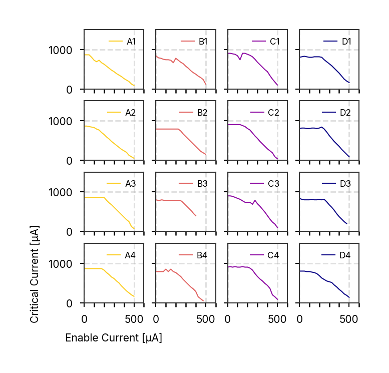

---

### plot_ic_enable_current_relation_v2_rows

**Script:** `plot_ic_enable_current_relation_v2_rows.py`

**Description:** No description available

**Image:** 

---

### plot_ic_temperature_sweep_array

**Script:** `plot_ic_temperature_sweep_array.py`

**Description:** Script to plot the critical current vs enable current.
Enable current was swept through the linear region of the hTron reponse.

**Image:** 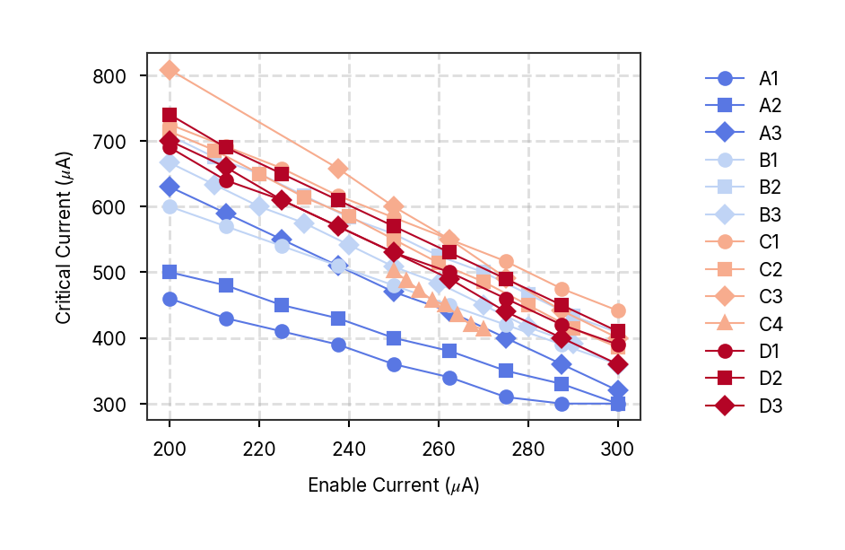

---

### plot_ic_vs_ih_array

**Script:** `plot_ic_vs_ih_array.py`

**Description:** No description available

**Image:** 

---

### plot_iv_temperature_sweep

**Script:** `plot_iv_temperature_sweep.py`

**Description:** Main function to generate IV temperature sweep plots.

**Images:**
- Figure 1: 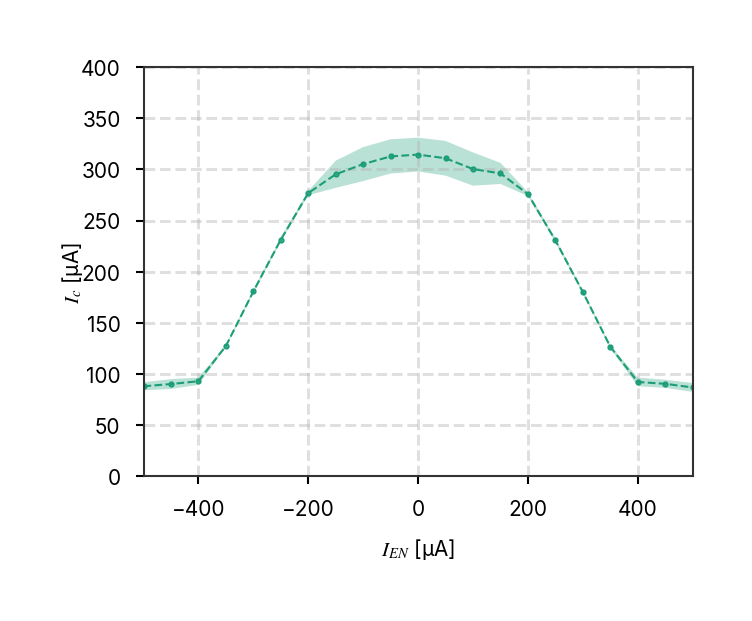
- Figure 2: 

---

### plot_read_current_operating_width_vs_write_current

**Script:** `plot_read_current_operating_width_vs_write_current.py`

**Description:** No description available

**Image:** 

---

### plot_state_current_vs_write_current

**Script:** `plot_state_current_vs_write_current.py`

**Description:** No description available

**Image:** 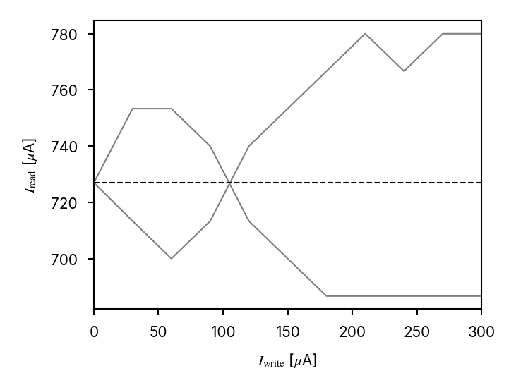

---

### plot_switching_probability_vs_read_current

**Script:** `plot_switching_probability_vs_read_current.py`

**Description:** No description available

**Image:** 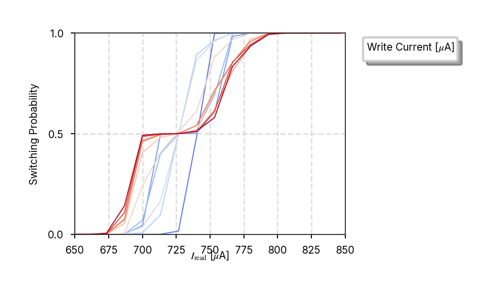

---

### plot_voltage_read_histogram

**Script:** `plot_voltage_read_histogram.py`

**Description:** No description available

**Image:** 

---

### plot_voltage_trace_array_emulation

**Script:** `plot_voltage_trace_array_emulation.py`

**Description:** No description available

**Image:** 

---

### plot_voltage_trace_averaged

**Script:** `plot_voltage_trace_averaged.py`

**Description:** Script to plot averaged voltage traces from a directory of data files.

**Image:** 

---

### plot_voltage_trace_toggle_write_enable

**Script:** `plot_voltage_trace_toggle_write_enable.py`

**Description:** Plot voltage traces and write current sweep analysis with write enable toggle.

This script analyzes voltage traces and bit error rates with the write enable
signal toggled on and off. Generates four plots arranged in a 2x2 layout:
- Write current sweep plots (BER vs write current) for enable OFF/ON
- Voltage trace stack plots for enable OFF/ON

Enables comparison of memory cell behavior with and without write enable.

**Voltage Trace Toggle Write Enable (2x2 Layout):**

| Enable OFF | Enable ON |
|------------|----------|
|  |  |
|  |  |

---

## Script Execution

All plots were generated using:

```bash
python run_all_plotting_scripts.py --style paper
```

Individual plots can be regenerated by running their respective scripts in the `src/nmem/scripts/` directory.
