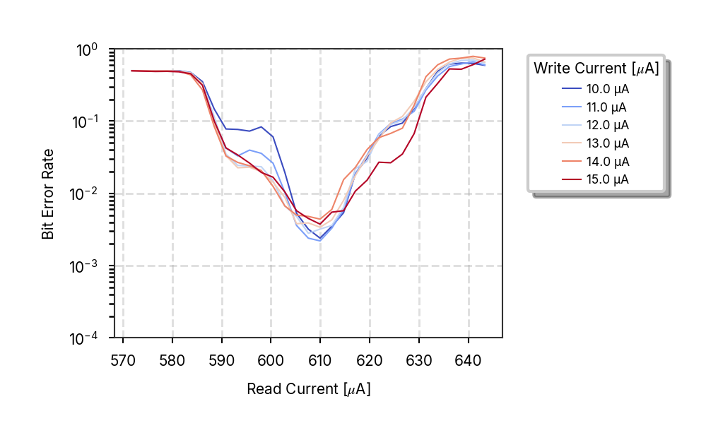
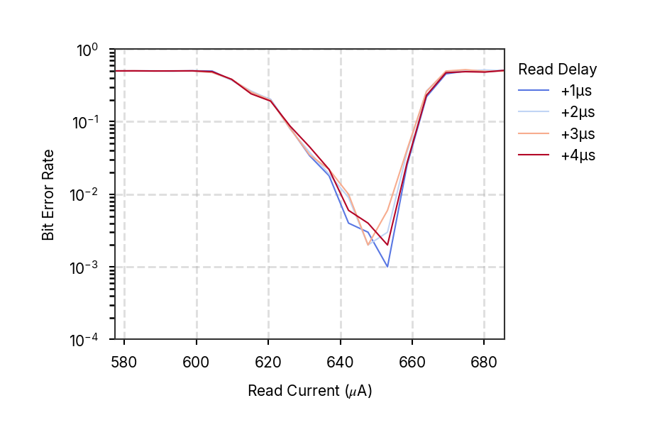
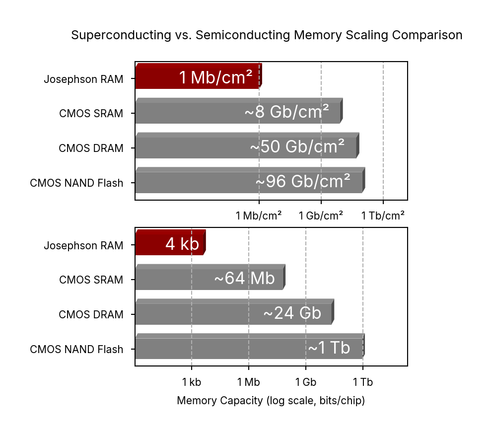
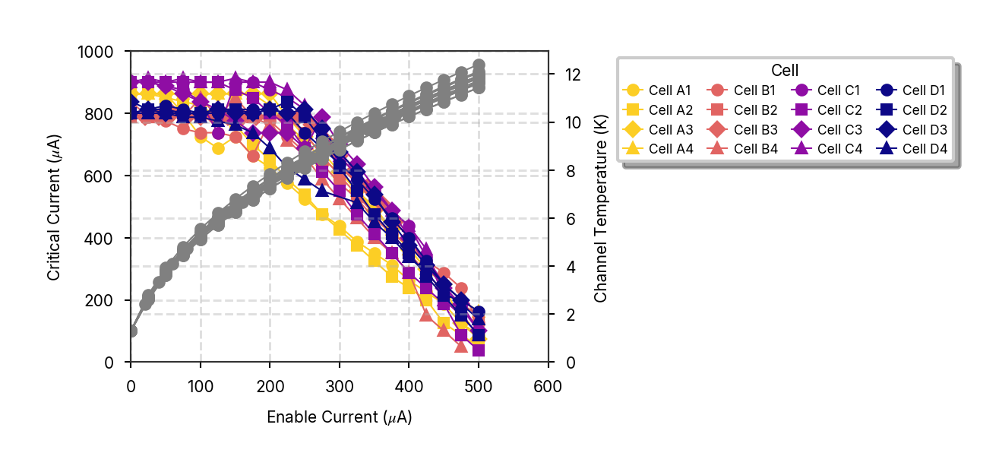
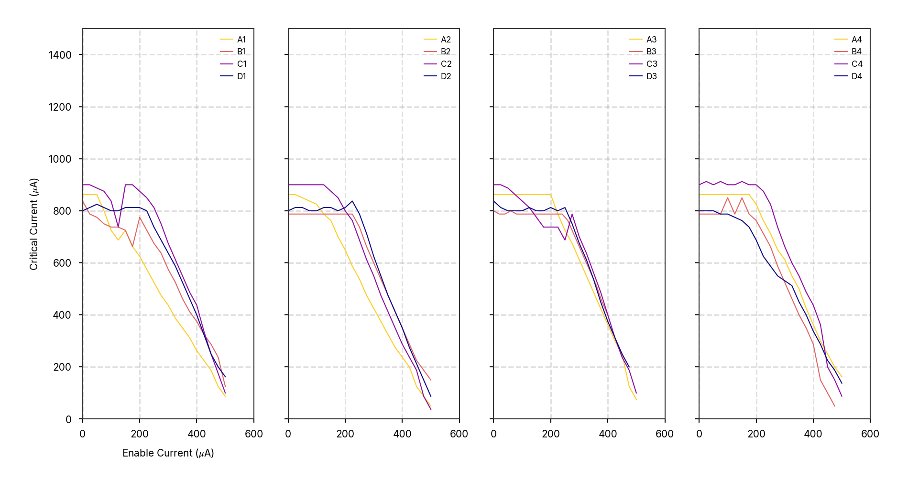
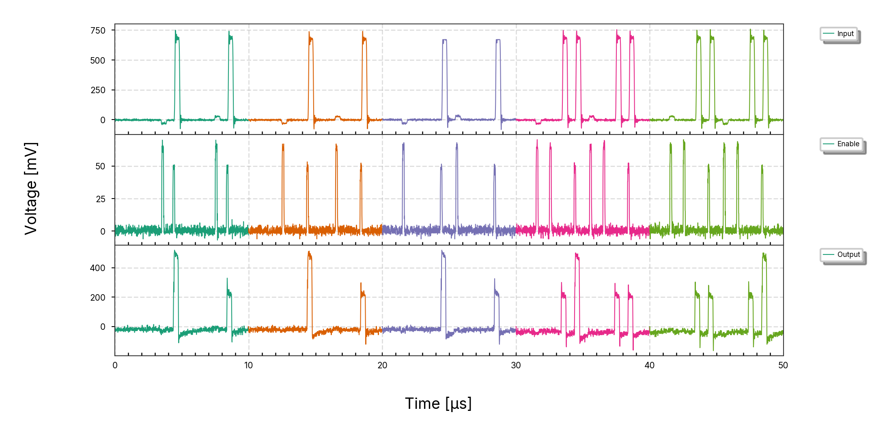
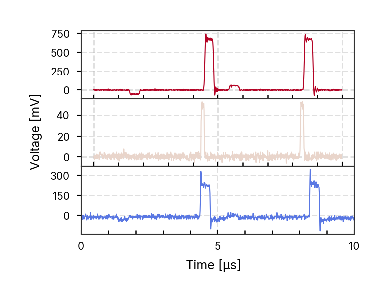
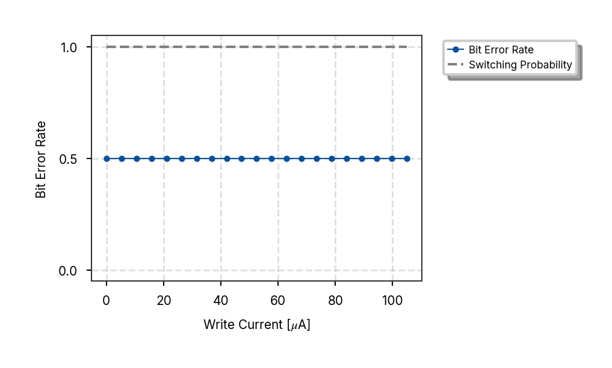
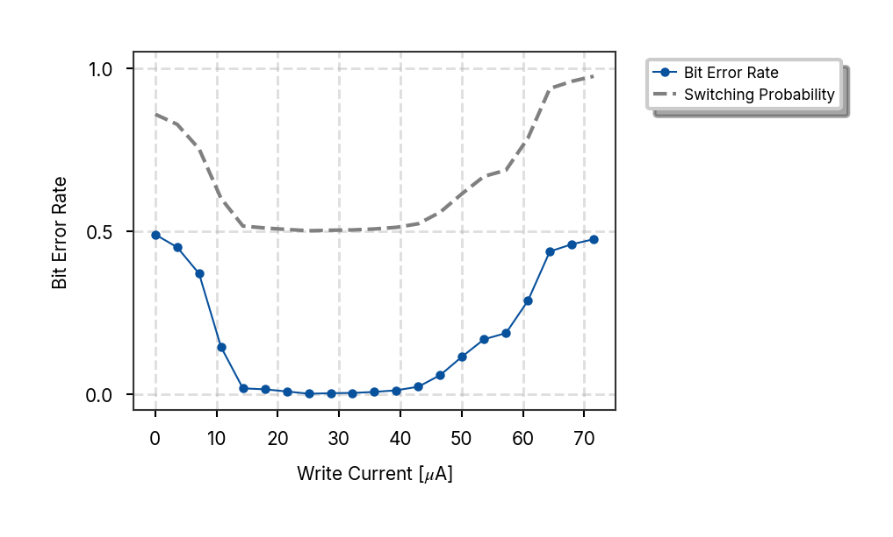

# nmem Plots Documentation

This directory contains plots generated by the nmem project plotting scripts.

**Plot Style:** paper
**Generated:** 2025-06-26 11:25:23
**Total Plots:** 58

## Plots Overview

### plot_array_fidelity_bar

**Script:** `plot_array_fidelity_bar.py`

**Description:** Generate array fidelity bar plots showing bit error rates across memory array positions.

Creates both 3D and clean 2D bar visualizations of BER data to analyze
memory array performance and identify spatial patterns in error rates.

**Images:**
- 
- 

---

### plot_array_parameter_matrix

**Script:** `plot_array_parameter_matrix.py`

**Description:** Generate array parameter matrix visualization showing write current distribution across memory cells.

Creates a spatial heatmap displaying write current parameters for each cell position
in the memory array, enabling identification of process variations and optimization
of array-level performance characteristics.


---

### plot_autoprobe_resistance_matrix

**Script:** `plot_autoprobe_resistance_matrix.py`

**Description:** No description available


---

### plot_ber_branch_currents_sweep

**Script:** `plot_ber_branch_currents_sweep.py`

**Description:** No description available


---

### plot_ber_enable_write_sweep

**Script:** `plot_ber_enable_write_sweep.py`

**Description:** Bit Error Rate vs Enable/Write Current Sweep Analysis

This script analyzes and visualizes the relationship between bit error rate (BER)
and enable/write current combinations. It generates plots showing how BER varies
with different current settings, helping to identify optimal operating parameters
for memory write operations. Includes both sweep plots and state current markers
to provide comprehensive analysis of write current dependencies.

**Images:**
- 
- 

---

### plot_ber_enable_write_sweep_fine

**Script:** `plot_ber_enable_write_sweep_fine.py`

**Description:** Main function to plot fine enable write sweep.


---

### plot_ber_enable_write_sweep_persistent_current

**Script:** `plot_ber_enable_write_sweep_persistent_current.py`

**Description:** Main function to plot persistent current and measured state currents.


---

### plot_ber_enable_write_sweep_supplemental

**Script:** `plot_ber_enable_write_sweep_supplemental.py`

**Description:** No description available


---

### plot_ber_memory_retention

**Script:** `plot_ber_memory_retention.py`

**Description:** No description available


---

### plot_ber_prbs_probe_station_trace

**Script:** `plot_ber_prbs_probe_station_trace.py`

**Description:** No description available


---

### plot_ber_read_current_operating

**Script:** `plot_ber_read_current_operating.py`

**Description:** No description available


---

### plot_ber_read_current_sweep_enable_read

**Script:** `plot_ber_read_current_sweep_enable_read.py`

**Description:** No description available


---

### plot_ber_read_current_sweep_enable_write

**Script:** `plot_ber_read_current_sweep_enable_write.py`

**Description:** No description available


---

### plot_ber_read_current_sweep_ew_width

**Script:** `plot_ber_read_current_sweep_ew_width.py`

**Description:** No description available


---

### plot_ber_read_current_sweep_read_width

**Script:** `plot_ber_read_current_sweep_read_width.py`

**Description:** No description available


---

### plot_ber_read_current_sweep_sim

**Script:** `plot_ber_read_current_sweep_sim.py`

**Description:** No description available


---

### plot_ber_read_current_sweep_three

**Script:** `plot_ber_read_current_sweep_three.py`

**Description:** No description available


---

### plot_ber_read_current_sweep_write_current

**Script:** `plot_ber_read_current_sweep_write_current.py`

**Description:** Main function to generate BER read current sweep write current plots.

**Images:**
- 
- 

---

### plot_ber_read_current_sweep_write_current2

**Script:** `plot_ber_read_current_sweep_write_current2.py`

**Description:** Main function to plot read current sweep data.


---

### plot_ber_read_current_sweep_write_current3

**Script:** `plot_ber_read_current_sweep_write_current3.py`

**Description:** No description available

**Images:**
- 
- 

---

### plot_ber_read_current_sweep_write_current_coarse

**Script:** `plot_ber_read_current_sweep_write_current_coarse.py`

**Description:** No description available


---

### plot_ber_read_current_sweep_write_current_fine

**Script:** `plot_ber_read_current_sweep_write_current_fine.py`

**Description:** No description available



---

### plot_ber_read_current_sweep_write_width

**Script:** `plot_ber_read_current_sweep_write_width.py`

**Description:** No description available


---

### plot_ber_read_sweep_fitting

**Script:** `plot_ber_read_sweep_fitting.py`

**Description:** No description available


---

### plot_ber_read_sweep_memory_retention

**Script:** `plot_ber_read_sweep_memory_retention.py`

**Description:** No description available



---

### plot_ber_write_current_sweep_enable_margin

**Script:** `plot_ber_write_current_sweep_enable_margin.py`

**Description:** No description available


---

### plot_ber_write_current_sweep_operation

**Script:** `plot_ber_write_current_sweep_operation.py`

**Description:** No description available


---

### plot_c2_c3_comparison

**Script:** `plot_c2_c3_comparison.py`

**Description:** No description available


---

### plot_c2_c3_subplots

**Script:** `plot_c2_c3_subplots.py`

**Description:** No description available


---

### plot_compare_energy_bar

**Script:** `plot_compare_energy_bar.py`

**Description:** Energy Comparison Bar Chart

This script generates a 3D extruded bar chart comparing energy consumption
across different memory technologies. The plot visualizes energy per bit
operation for various superconducting and semiconducting memory types,
providing a clear comparison of their energy efficiency characteristics.


---

### plot_compare_metrics_spider

**Script:** `plot_compare_metrics_spider.py`

**Description:** No description available


---

### plot_compare_size_bar

**Script:** `plot_compare_size_bar.py`

**Description:** Generate memory scaling comparison plots showing capacity and density.



---

### plot_elionix_log_alignment

**Script:** `plot_elionix_log_alignment.py`

**Description:** Main function to import, analyze, and plot Elionix alignment log data.

Args:
    save_dir: If provided, saves figures to this directory instead of using individual save parameters

**Images:**
- 
- 

---

### plot_enable_current_vs_temp

**Script:** `plot_enable_current_vs_temp.py`

**Description:** No description available



---

### plot_geom_loop_size

**Script:** `plot_geom_loop_size.py`

**Description:** No description available


---

### plot_ic_enable_current_relation_v2

**Script:** `plot_ic_enable_current_relation_v2.py`

**Description:** Main function to plot enable current relation grids and columns/rows.

Args:
    save_dir: If provided, saves figures to this directory instead of showing them

**Images:**
- 
- 
- 
- 

---

### plot_ic_temperature_sweep_array

**Script:** `plot_ic_temperature_sweep_array.py`

**Description:** No description available


---

### plot_ic_vs_ih_array

**Script:** `plot_ic_vs_ih_array.py`

**Description:** No description available


---

### plot_iv_temperature_sweep

**Script:** `plot_iv_temperature_sweep.py`

**Description:** Main function to generate IV temperature sweep plots.

**Images:**
- 
- 
- 

---

### plot_ntron_dose_images

**Script:** `plot_ntron_dose_images.py`

**Description:** No description available


---

### plot_voltage_read_histogram

**Script:** `plot_voltage_read_histogram.py`

**Description:** No description available


---

### plot_voltage_trace_array_emulation

**Script:** `plot_voltage_trace_array_emulation.py`

**Description:** No description available



---

### plot_voltage_trace_averaged

**Script:** `plot_voltage_trace_averaged.py`

**Description:** No description available


---

### plot_voltage_trace_stack_off

**Script:** `plot_voltage_trace_stack_off.py`

**Description:** No description available



---

### plot_voltage_trace_stack_on

**Script:** `plot_voltage_trace_stack_on.py`

**Description:** No description available


---

### plot_voltage_write_current_sweep_off

**Script:** `plot_voltage_write_current_sweep_off.py`

**Description:** No description available



---

### plot_voltage_write_current_sweep_on

**Script:** `plot_voltage_write_current_sweep_on.py`

**Description:** No description available



---

### plot_wafer_thickness_map

**Script:** `plot_wafer_thickness_map.py`

**Description:** No description available


---

## Usage

**Regenerate all plots:**
```bash
python run_all_plotting_scripts.py --style paper
```

**Update this documentation:**
```bash
python update_plots_readme.py
```

**Individual plots:** Run the corresponding script in `src/nmem/scripts/`
